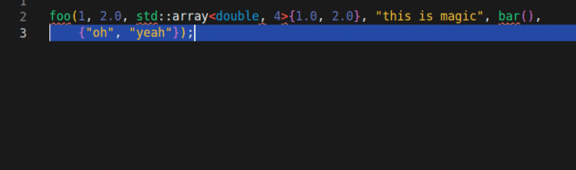

# README

Formats arguments of selected C++-function calls to a single argument per line. Optionally, the document can automatically be saved after modifying it.
This allows for automatic formatting through the native VS Code `editor.formatOnSave` option.  
**Only active for C++ files.**

## Features
Simply select the text to change and select `One Argument per Line: Format Selection` from the command palette.
Alternatively, use the provided keybinding (defaults to `ctrl+f1`).  

## Options
Adapt the extensions behavior by your user/workspace settings:

| Name                                              | Description                                        | Default Value |
| ------------------------------------------------- | -------------------------------------------------- | ------------- |
| `one-argument-per-line-clang-format.saveDocument` | Calls `document.save()` after string manipulation. | `true`        |

## Keybindings

| Name                                        | Description       | Default Value |
| ------------------------------------------- | ----------------- | ------------- |
| `one-argument-per-line-clang-format.format` | Format selection. | `ctrl+f1`     |

## Requirements
The `saveDocument` option will only have a noticeable effect if the `editor.formatOnSave` option is `true` and some default formatter is set (manually or through some other extension).  
This was tested with the well-known clang-format formatter. 
## Known Issues
Nothing known so far. 

**Please report bugs! This is a very early version!**

**Enjoy!**
