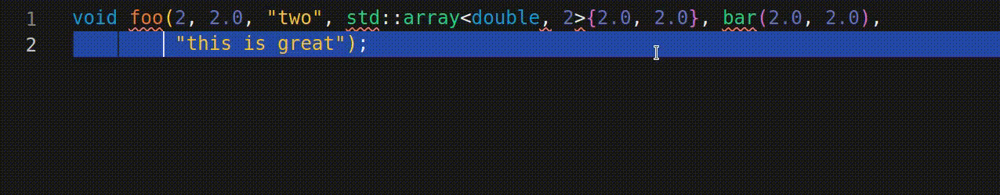

# README

Formats arguments of selected function calls to a single argument per line using clang-format modifiers.
Simply select the text to change, and select "One Argument per Line: Format Selection" from the command palette.
Alternatively, use the provided keybinding (defaults to ctrl+f1).

## Features

## Options
Adapt the extensions behavior by your user/workspace settings:

| Name                                              | Description                                       | Default Value |
| ------------------------------------------------- | ------------------------------------------------- | ------------- |
| `one-argument-per-line-clang-format.saveDocument` | Call `document.save()` after string manipulation. | `true`        |

## Requirements
If `saveDocument` is `true`, it is assumed that some formatter is set (manually or through some other extension) and the `format-on-save` option is `true`.
This was tested with the well-known clang-format formatter. 
## Known Issues
Nothing known so far. 

**Please report more bugs! This is a very early version!**

**Enjoy!**
